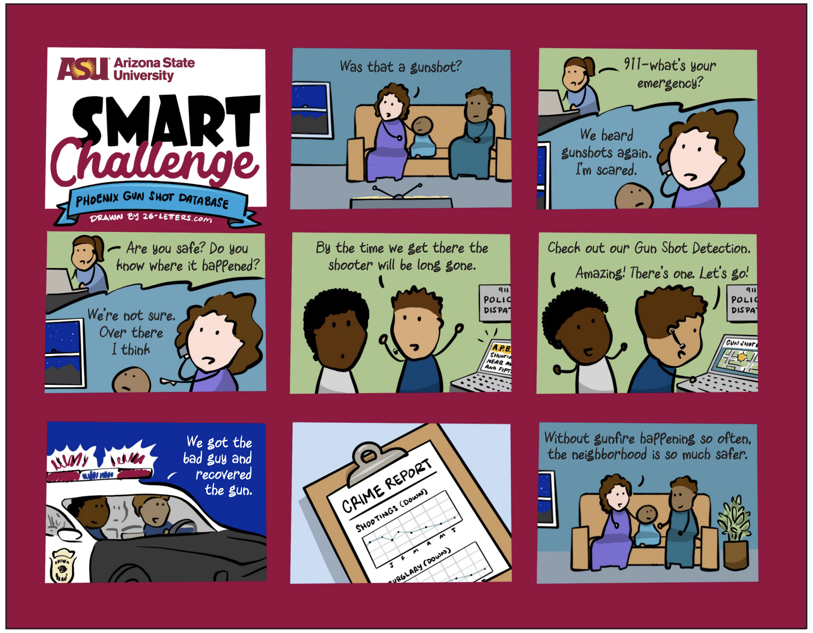
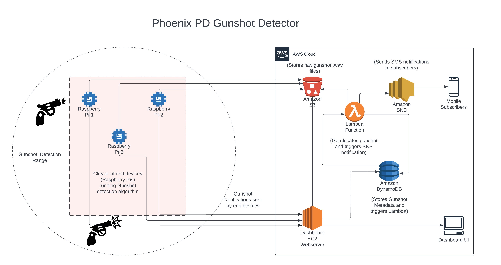

Phoenix City PD: Gunshot Detection (Work In Progress)

|Index| Description|
|:----------------|:-----------|
| [Overview](#overview)         |     See the motivation behind this project.    | 
| [Description](#description)         |     Learn more about the problem, implemented solution and challenges faced.    | 
| [Deployment Guide](#deployment)         |    How to install and deploy __insert product name here__ . |
| [How to Use](#how-to-use)       |     Instructions to use __insert product name here__.   |
| [Future Enhancements and Limitations](#future-enhancements)       |     Limitations and next steps which can be taken.   |
| [Credits](#credits)      |     Meet the team behind this.     |
| [License](#license)      |     License details.     |

# Overview

# Description

Identifying gun incidents in real time can help police, respond faster, identify criminals and reduce gun violence. Existing systems are expensive to deploy and operate which prevents some cities from being able to access the solution and to deploy in a large enough area to be effective. Existing systems can also take a long-time to provide responding officer with the inncident information which limits an effective response. 

The ASU CIC and the Phoenix Police Department worked together to reimagine how to develop a solution that would be inexpensive, easy to deploy extensively, reduce societal challenges with how they are used, and turn a gunshot detection alerts into identified offenders.  

## Problem
Today, over 2,000 gun incidents occur in the City of Phoenix each year on average and the rate of gun violence is increasing according to EveryStat for Gun Violence. Additionally,  gun violence costs Arizona taxpayers $263.2 million each year. According to the CDC (2019), Arizona has a rate of death due to firearm injury of 15.1 per 100,000 and 1,136 citizens died of firearm injury in 2019. Getting the right information to the right officers at the right time is a challenge to identifying , catching, and prosecuting offenders. Without a gunshot detection system, police have to rely on being in the area at the right time or a 911 call, which puts too much time between the gunshot and responding officers. Too often with existing gunshot detection systems there is a long delay between the time a gun is fired and when patrol officers receive the alert. By the time responding officers get to the scene, the offenders have fled. The cost of other detection systems prevents the wide scale deployment, which limits effectiveness.

## Architecture Diagram

## Functionality 
Our project combines [Gunshot detection algorithm for Raspberry Pi](https://github.com/gabemagee/gunshot_detection) and AWS to implement the workflow in the above architecture diagram.

## Technologies

**Amazon Web Services:**
- [Lambda functions and layers](https://aws.amazon.com/lambda/)
- [DynamoDB](https://aws.amazon.com/dynamodb/)
- [Simple Storage Service](https://aws.amazon.com/s3/)
- [Simple Notification Service](https://aws.amazon.com/sns)
- [Elastic Compute Cloud](https://aws.amazon.com/ec2/)

## Assumptions
Talk about the assumptions behind this challenge, explain why they were taken. These include Business and Technology related assumptions.
For example, in the [Phoenix pedestrian fatalities challenge](https://smartchallenges.asu.edu/curbphx-sidewalk-inventory), City of Phoenix - Street Transportation department wanted a sidewalk inventory which can be used to keep track of status of the sidewalks, know which areas have no sidewalk and many more. 

Here Business assumptions were:
- To use Aerial drone imagery (provided by Eagleview) over Google Street View as the City of Phoenix had images from the same provider
- To focus on type of sidewalks or if sidewalks don't exist rather than finding details like if a sidewalk ramp exists or if there are cracks on the sidewalk

Technology Assumptions were:
- Being a prototype, we do not create an architecture which can be scaled up for millions of images as the purpose is to demonstrate a proof of concept
- Users have access to at least 500 images with atleast 100+ images per label (sidewalk, detached sidewalk, no sidewalk)
- Every image has a metadata information associated by it in some way or other which needs to cleaned and formatted in a particular pattern

# Deployment

Explain the process of how to deploy your application in detail. You may create a separate document and add a link to that document in this section as demonstrated below.

Refer to following documents for each deployment steps:
1. [General Deployment guidelines](./docs/deployment.md)
2. [Specific service Deployment Guide](./docs/rekognition.md)

The guide should contain deployment steps for each service used with exact steps outlined. For example, if you are using S3 buckets then explain how to create a bucket, what should they name it as or what naming convention should be followed then explain about how to link that service with another services.

Videos will help others understand the steps better so make sure to include some. You may upload to YouTube/Vimeo/Dailymotion and embed it here or create small recordings, convert them to GIFs and upload to the repository itself. 

# How to use
This section aims to give a demo of how to use this project. Make sure to include screenshots and detailed step-by-step instructions. You may also upload a video of the demo or a link to it. But makes sure it is user-friendly and explained simple enough to be understood by a layman.

# Future Enhancements
What are the possible steps that can be taken to improve this product? List out all possible ways that you have thought of to improve on this solution. Go through the 'Out of Scope' section in the Asana board of your challenge and you will find a lot of features that were dropped which can be included here.

## Limitations
Explain the limitations of this challenge. Why they occur and how they can be tackled to improve upon.
For example:
 - Say you use a Lambda service to handle the processing part of your application. As Lambda comes with a max run-time of 15 minutes, the limitation of your application will be that it can not process requests that take more than 15 minutes to complete.
 - If you are using Amazon Rekognition to detect objects in an image, this service is particularly expensive if left running, so the limitation would be that the service should not run longer than lets say 8 hours per day. 
 - Say you are using the default DynamoDB provisioning configuration, then the number of parallel requests that can be made per second are restricted, which can affect scaling up of the application. 

# Credits

"phoenix-pd-gunshot-detection" is an open source software. The following people have contributed to this project.

**Developers:**  
[Krishna Teja Kalaparty](https://www.linkedin.com/in/krishna-teja-kalaparty-a073b5195/)  
[Risabh Raj](https://www.linkedin.com/in/risabh-raj/)  
[Soham Sahare](https://www.linkedin.com/in/sohamsahare11/)  
[Sameet Kumar](https://www.linkedin.com/in/sameethkrishna/)  
[Yug Gulati](https://www.linkedin.com/in/yug-gulati/)  

**Sr. Program Manager, AWS:**  [Jubleen Vilku](https://www.linkedin.com/in/jubleen-vilku/)

**Digital Innovation Lead, AWS:** [Jason Whittet](https://www.linkedin.com/in/jasonwhittet/)

**General Manager, ASU:** [Ryan Hendrix](https://www.linkedin.com/in/ryanahendrix/)

This project is designed and developed with guidance and support from the [ASU Cloud Innovation Center](https://smartchallenges.asu.edu/) and the [City of Phoenix, Arizona](https://www.phoenix.gov/streets/) teams. 