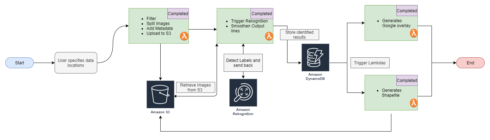
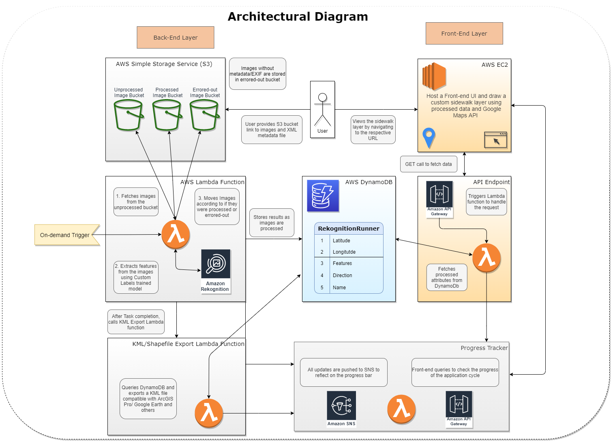

|Index| Description|
|:----------------|:-----------|
| [Overview](#overview)         |     See the motivation behind this project.    | 
| [Description](#description)         |     Learn more about the problem, implemented solution and challenges faced.    | 
| [Deployment Guide](#deployment)         |    How to install and deploy __insert product name here__ . |
| [How to Use](#how-to-use)       |     Instructions to use __insert product name here__.   |
| [Future Enhancements and Limitations](#future-enhancements)       |     Limitations and next steps which can be taken.   |
| [Credits](#credits)      |     Meet the team behind this.     |
| [License](#license)      |     License details.     |

# Overview
Give an overview of the challenge. What was the motivation behind this project? Who are we collaborating with? What is the solution presented in this repository? What problems will this challenge solve? Give a summary of all these questions which should be explained in detail in the following sections.

# Description

The best resource for filling this as well as the following sections is the 'ASU CIC Blogpost' of the challenge that you are working on. 100% of the times, the ASU CIC Blogpost is written and published only after multiple reviews with the customer and hence we need to make sure that we do not change the description, approach or the problem by paraphrasing it incorrectly. 

Refer: https://smartchallenges.asu.edu/challenges

## Problem
Explain the problem in detail here and explain the benefits of solving this problem.
Refer: https://smartchallenges.asu.edu/challenges

## Approach
Explain the approach of the problem in brief here and include links to all organizations and services that are mentioned.
Refer: https://smartchallenges.asu.edu/challenges

## Architecture Diagram

As seen in the example images below, we create a high level overview of the architecture and then a detailed version of the same.

High-level overview of the application

This chart should explain the work-flow and show which services are being used in the solution. The process flow chart should be created during the development of the solution and should be used to keep track of which services are currently under development and which of them are completed. This chart gives a good overview to the team as well as the customers during a bi-weekly update.

Detailed Architectural diagram

The detailed architecture diagram should include the data-flow, database schema, interactions & integrations between services, and finally the user's role/ possible interactions. This diagram is usually updated as changes are made in the architecture or new features are added. 

These diagrams can be made using https://app.diagrams.net/ .

## Functionality 
Explain the functionality of the problem and talk about the major challenges faced during the development process. Explain the techniques used to tackle these challenges. Provide visual cues or images which will help a layman understand the challenge and the solution incorporated to solve the problem.

## Technologies
List all the technologies, services, libraries, and frameworks used in this project. Provide a link to their website or documentation URL for all of them. 
For example:

1. Amazon Web Services ->
    - [Lambda functions and layers](https://aws.amazon.com/lambda/)
    - [DynamoDB](https://aws.amazon.com/dynamodb/)
    - [Amazon Rekognition](https://aws.amazon.com/rekognition/)
    - [Simple Storage Service](https://aws.amazon.com/s3/)
    - [Simple Notification Service](https://aws.amazon.com/sns/?whats-new-cards.sort-by=item.additionalFields.postDateTime&whats-new-cards.sort-order=desc)
    - [Virtual Private Cloud](https://aws.amazon.com/vpc/)
    - [Elastic Compute Cloud](https://aws.amazon.com/ec2/)
2. GIS ->
    - [GeoPandas](https://geopandas.org/en/stable/) 
    - [Shapely](https://shapely.readthedocs.io/en/stable/manual.html)
    - [ArcGIS/ ArcGIS Pro](https://www.arcgis.com/index.html)

## Assumptions
Talk about the assumptions behind this challenge, explain why they were taken. These include Business and Technology related assumptions.
For example, in the [Phoenix pedestrian fatalities challenge](https://smartchallenges.asu.edu/curbphx-sidewalk-inventory), City of Phoenix - Street Transportation department wanted a sidewalk inventory which can be used to keep track of status of the sidewalks, know which areas have no sidewalk and many more. 

Here Business assumptions were:
- To use Aerial drone imagery (provided by Eagleview) over Google Street View as the City of Phoenix had images from the same provider
- To focus on type of sidewalks or if sidewalks don't exist rather than finding details like if a sidewalk ramp exists or if there are cracks on the sidewalk

Technology Assumptions were:
- Being a prototype, we do not create an architecture which can be scaled up for millions of images as the purpose is to demonstrate a proof of concept
- Users have access to at least 500 images with atleast 100+ images per label (sidewalk, detached sidewalk, no sidewalk)
- Every image has a metadata information associated by it in some way or other which needs to cleaned and formatted in a particular pattern

# Deployment

Explain the process of how to deploy your application in detail. You may create a separate document and add a link to that document in this section as demonstrated below.

Refer to following documents for each deployment steps:
1. [General Deployment guidelines](./docs/deployment.md)
2. [Specific service Deployment Guide](./docs/rekognition.md)

The guide should contain deployment steps for each service used with exact steps outlined. For example, if you are using S3 buckets then explain how to create a bucket, what should they name it as or what naming convention should be followed then explain about how to link that service with another services.

Videos will help others understand the steps better so make sure to include some. You may upload to YouTube/Vimeo/Dailymotion and embed it here or create small recordings, convert them to GIFs and upload to the repository itself. 

# How to use
This section aims to give a demo of how to use this project. Make sure to include screenshots and detailed step-by-step instructions. You may also upload a video of the demo or a link to it. But makes sure it is user-friendly and explained simple enough to be understood by a layman.

# Future Enhancements
What are the possible steps that can be taken to improve this product? List out all possible ways that you have thought of to improve on this solution. Go through the 'Out of Scope' section in the Asana board of your challenge and you will find a lot of features that were dropped which can be included here.

## Limitations
Explain the limitations of this challenge. Why they occur and how they can be tackled to improve upon.
For example:
 - Say you use a Lambda service to handle the processing part of your application. As Lambda comes with a max run-time of 15 minutes, the limitation of your application will be that it can not process requests that take more than 15 minutes to complete.
 - If you are using Amazon Rekognition to detect objects in an image, this service is particularly expensive if left running, so the limitation would be that the service should not run longer than lets say 8 hours per day. 
 - Say you are using the default DynamoDB provisioning configuration, then the number of parallel requests that can be made per second are restricted, which can affect scaling up of the application. 

# Credits

Include credits for every member that worked on this challenge, explain their role in a single word/phrase, leave a LinkedIn URL for them or any other website they would like to be included. 
Add links about the organizations that you might have collaborated with.

For example:

**Developers:**
- [Mary Jane](https://www.linkedin.com/)

**UI Designers:**
- [John Doe](https://www.linkedin.com/)

**Subject Matter Experts:**
- [Jane Smith](https://www.linkedin.com/)

**Sr. Program Manager, AWS:**  [Jubleen Vilku](https://www.linkedin.com/in/jubleen-vilku/)

**Digital Innovation Lead, AWS:** [Jason Whittet](https://www.linkedin.com/in/jasonwhittet/)

**General Manager, ASU:** [Ryan Hendrix](https://www.linkedin.com/in/ryanahendrix/)

Finally, add the link to the ASU CIC website and other references as needed.
For example:

This project is designed and developed with guidance and support from the [ASU Cloud Innovation Center](https://smartchallenges.asu.edu/) and the [City of Phoenix, Arizona](https://www.phoenix.gov/streets/) teams. 