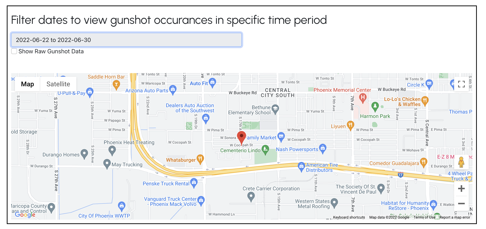

Phoenix City PD: Gunshot Detection (Work In Progress)

|Index| Description|
|:----------------|:-----------|
| [Overview](#overview)         |     See the motivation behind this project    | 
| [Description](#description)         |     Learn more about the problem, implemented solution and challenges faced    | 
| [Deployment Guide](#deployment)         |    How to install and deploy __phoenix-pd-gunshot-detection__ |
| [How to Use](#how-to-use)       |     Instructions to use __phoenix-pd-gunshot-detection__   |
| [Lessons Learned](#lessons-learned)       |     Limitations, lessons learned and next steps which can be taken   |
| [Bill Of Materials](#bill-of-materials)       |     Cost of deployment   |
| [Credits](#credits)      |     Meet the team behind this     |
| [License](#license)      |     License details     |

# Overview

# Description

Identifying gun incidents in real time can help police, respond faster, identify criminals and reduce gun violence. Existing systems are expensive to deploy and operate which prevents some cities from being able to access the solution and to deploy in a large enough area to be effective. Existing systems can also take a long-time to provide responding officer with the incident information which limits an effective response. 

The ASU CIC and the Phoenix Police Department worked together to reimagine how to develop a solution that would be inexpensive, easy to deploy extensively, reduce societal challenges with how they are used, and turn a gunshot detection alerts into identified offenders.  

## Problem
Today, over 2,000 gun incidents occur in the City of Phoenix each year on average and the rate of gun violence is increasing according to EveryStat for Gun Violence. Additionally,  gun violence costs Arizona taxpayers $263.2 million each year. According to the CDC (2019), Arizona has a rate of death due to firearm injury of 15.1 per 100,000 and 1,136 citizens died of firearm injury in 2019. Getting the right information to the right officers at the right time is a challenge to identifying , catching, and prosecuting offenders. Without a gunshot detection system, police have to rely on being in the area at the right time or a 911 call, which puts too much time between the gunshot and responding officers. Too often with existing gunshot detection systems there is a long delay between the time a gun is fired and when patrol officers receive the alert. By the time responding officers get to the scene, the offenders have fled. The cost of other detection systems prevents the wide scale deployment, which limits effectiveness.

## Architecture Diagram

## Functionality 
Our project combines [Gunshot detection algorithm for Raspberry Pi](https://github.com/gabemagee/gunshot_detection) and AWS to implement the workflow in the above architecture diagram.

## Technologies

**Amazon Web Services:**
- [Lambda functions and layers](https://aws.amazon.com/lambda/)
- [DynamoDB](https://aws.amazon.com/dynamodb/)
- [Simple Storage Service](https://aws.amazon.com/s3/)
- [Simple Notification Service](https://aws.amazon.com/sns)
- [Elastic Compute Cloud](https://aws.amazon.com/ec2/)

## Hardware
- [Raspberry Pi-4](https://www.raspberrypi.com/products/raspberry-pi-4-model-b/)
- [SiZHENG Microphone](https://www.amazon.com/COTT-S30-Microphone-Reduction-Monitoring-Security/dp/B07RR94G2T/)
- [ZTE Max WiFi Hotspot](https://www.amazon.com/ZTE-Unlocked-Download-Anywhere-Microfiber/dp/B08F2WW1H1)

# Deployment

Refer to following documents for each deployment steps:
1. [Gunshot detection algorithm installation on Raspberry Pis](./raspberry_pi/README.md)
2. [AWS guide]()
3. [Dashboard Website]()

The guide should contain deployment steps for each service used with exact steps outlined. For example, if you are using S3 buckets then explain how to create a bucket, what should they name it as or what naming convention should be followed then explain about how to link that service with another services.

Videos will help others understand the steps better so make sure to include some. You may upload to YouTube/Vimeo/Dailymotion and embed it here or create small recordings, convert them to GIFs and upload to the repository itself. 

# How to use
1. Log in using the provided credentials

2. Enter your phone number with country code and click on subscribe/unsubscribe

3. View and filter gunshot occurrences on the google map

# About the setup

## End device
The device consists of the following components:

1. Microphone
2. Wi-Fi Hotspot using a SIM
3. Power supply cord for Lightpoles
4. Raspberry Pi for processing
5. Casing to house the components
6. Waterproofing gel to encase the microphone
7. Rubber encasing to water proof the microphone

## AWS Cloud Service

1. DynamoDB as the datastore
2. Lambda functions for collecting data, triangulation, pushing notifications to SNS
3. SNS to send messages to officers about gunshots
4. UI to display the gunshot history, enable subscribe/unsubscribe for notifications
5. EC2 instance to host the UI

# Algorithm
There are third party paid solutions that detect gunshots but they have human intervention in the system where they verify the gun shot sound files recorded by the algorithm and then post approval the officers are notified about the gunshot. This process adds extra minutes to the verification workflow, our goal with the prototype is to eliminate the extra approval steps to cut the extra time. The extra time can come clutch for the officers to apprehend the shooter. 

To enable this, we do the following:

1. We install devices that listen continously and detect gunshots using a machine learning model. The devices are capable of listening to gunshots in a radius of ~100 feet, this can be improved greatly with the use better microphones which come at a higher cost or you may choose to build your own microphone array.

2. White the gunshot detection model trained to pick up gunshots, there are cases where it picks up on similar sounds such as fireworks, car backfire, flat tires, rainfall, etc. To mitigate this limitation, we add a filter machine learning model, that is trained to pick up gunshots among other similar sounds. 

3. If a gunshot is still detected after these two models, then we try to triangulate this gunshot using information from other end devices that might have picked up the sound at the same time range.

4. We the send out the triangulated gunshot location to our server, which then sends a notification to all officers/ point of contacts that are subscribed to the gunshot detection system. After which the Police can decide on how to handle the situation. 

## Machine Learning Model
We employ the following techniques for preprocessing and extracting features from the audio files.

 - Eliminating noise, Convoluted Fast Fourier Transformation
 - Padding with silence to make it equal length
 - Making the audio files Stereo channel by duplicating the wave file (if mono)
 - Spectral Roll off
 - Spectral Centroid
 - Mel Frequency Cepstral Coefficients 
 - Mel Spectogram Analysis

# Lessons Learned
 - A good quality microphone is the crux of our application, we needed something small enough to fit inside the casing while also having high quality sound recording capabilities, omnidirectional, high range, and inexpensive. Such a microphone is hard to find in the market, a better solution is to build your own microphone array using bread boards and electret microphones. These arrays are highly customizable and can carry as many microphones to enhance hearing capabilities.

 - Making a small, robust, weather proof, and inexpensive casing is very important as we want our end devices to fit around poles or high reaching structures easily and we should be able to hide them so that they are not spotted easily. They should be capable of handling high heat, rainfall, snowfall, birds, etc so the devices do not lose power/ fail randomly.

 - Making the device heat resistant is crucial for places like Arizona, as devices overheat very easily. Painting the device white, using heat resistant semi conductor casings can be a few ways to employ this. Similarly, the devices would need to made rain and snow resistant according to the areas it is housed in.

 - As these devices are installed on high reaching structures, it is very difficult to remove them from their spots and make changes. It is important to have a proper setup so we don't need to make these changes often.

 - As these devices need to communicate with the cloud, we need access to the internet. We use hotspot devices equipped with a SIM for constant internet access, these hotspot need to be properly installed and turned on before the device is placed at their respective spots. We had to make sure we turn off the sleep functionality so they are functioning 24/7.

 - A well trained set of machine learning models trained using the audio recorded by the devices so it can better detect the gunshots and identify non gunshots like mentioned previously. Using external datasets of gunshots and non gunshots doesn't give good performance on recorded audio files because of the differences of the equipment used to record the instances.

# Bill Of Materials
> To be updated

# Credits

**phoenix-pd-gunshot-detection** is an open source software. The following people have contributed to this project.

**Developers:**  
- [Krishna Teja Kalaparty](https://www.linkedin.com/in/krishna-teja-kalaparty-a073b5195/)  
- [Risabh Raj](https://www.linkedin.com/in/risabh-raj/)  
- [Soham Sahare](https://www.linkedin.com/in/sohamsahare11/)  
- [Sameet Kumar](https://www.linkedin.com/in/sameethkrishna/)  
- [Yug Gulati](https://www.linkedin.com/in/yug-gulati/)  

**Sr. Program Manager, AWS:**  [Jubleen Vilku](https://www.linkedin.com/in/jubleen-vilku/)

**Digital Innovation Lead, AWS:** [Jason Whittet](https://www.linkedin.com/in/jasonwhittet/)

**General Manager, ASU:** [Ryan Hendrix](https://www.linkedin.com/in/ryanahendrix/)

This project is designed and developed with guidance and support from the [ASU Cloud Innovation Center](https://smartchallenges.asu.edu/) and the [City of Phoenix, Arizona](https://www.phoenix.gov/police) teams. 

# License
This project is distributed under the [Apache License 2.0](https://github.com/ASUCICREPO/phoenix-pd-gunshot-detection/blob/master/LICENSE)
