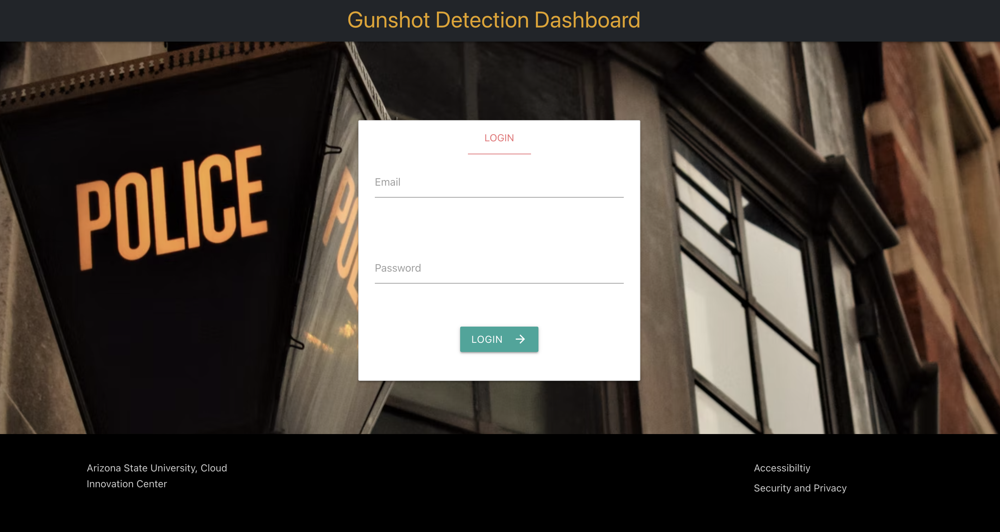

Phoenix City PD: Gunshot Detection (Work In Progress)

|Index| Description|
|:----------------|:-----------|
| [Overview](#overview)         |     See the motivation behind this project    | 
| [Description](#description)         |     Learn more about the problem, implemented solution and challenges faced    | 
| [Deployment Guide](#deployment)         |    How to install and deploy __phoenix-pd-gunshot-detection__ |
| [How to Use](#how-to-use)       |     Instructions to use __phoenix-pd-gunshot-detection__   |
| [Credits](#credits)      |     Meet the team behind this     |
| [License](#license)      |     License details     |

# Overview

# Description

Identifying gun incidents in real time can help police, respond faster, identify criminals and reduce gun violence. Existing systems are expensive to deploy and operate which prevents some cities from being able to access the solution and to deploy in a large enough area to be effective. Existing systems can also take a long-time to provide responding officer with the incident information which limits an effective response. 

The ASU CIC and the Phoenix Police Department worked together to reimagine how to develop a solution that would be inexpensive, easy to deploy extensively, reduce societal challenges with how they are used, and turn a gunshot detection alerts into identified offenders.  

## Problem
Today, over 2,000 gun incidents occur in the City of Phoenix each year on average and the rate of gun violence is increasing according to EveryStat for Gun Violence. Additionally,  gun violence costs Arizona taxpayers $263.2 million each year. According to the CDC (2019), Arizona has a rate of death due to firearm injury of 15.1 per 100,000 and 1,136 citizens died of firearm injury in 2019. Getting the right information to the right officers at the right time is a challenge to identifying , catching, and prosecuting offenders. Without a gunshot detection system, police have to rely on being in the area at the right time or a 911 call, which puts too much time between the gunshot and responding officers. Too often with existing gunshot detection systems there is a long delay between the time a gun is fired and when patrol officers receive the alert. By the time responding officers get to the scene, the offenders have fled. The cost of other detection systems prevents the wide scale deployment, which limits effectiveness.

## Architecture Diagram

## Functionality 
Our project combines [Gunshot detection algorithm for Raspberry Pi](https://github.com/gabemagee/gunshot_detection) and AWS to implement the workflow in the above architecture diagram.

## Technologies

**Amazon Web Services:**
- [Lambda functions and layers](https://aws.amazon.com/lambda/)
- [DynamoDB](https://aws.amazon.com/dynamodb/)
- [Simple Storage Service](https://aws.amazon.com/s3/)
- [Simple Notification Service](https://aws.amazon.com/sns)
- [Elastic Compute Cloud](https://aws.amazon.com/ec2/)

## Hardware
- [Raspberry Pi-4](https://www.raspberrypi.com/products/raspberry-pi-4-model-b/)
- [SiZHENG Microphone](https://www.amazon.com/COTT-S30-Microphone-Reduction-Monitoring-Security/dp/B07RR94G2T/)
- [ZTE Max WiFi Hotspot](https://www.amazon.com/ZTE-Unlocked-Download-Anywhere-Microfiber/dp/B08F2WW1H1)

# Deployment

Refer to following documents for each deployment steps:
1. [Gunshot detection algorithm installation on Raspberry Pis](./raspberry_pi/README.md)
2. [AWS guide]()
3. [Dashboard Website]()

The guide should contain deployment steps for each service used with exact steps outlined. For example, if you are using S3 buckets then explain how to create a bucket, what should they name it as or what naming convention should be followed then explain about how to link that service with another services.

Videos will help others understand the steps better so make sure to include some. You may upload to YouTube/Vimeo/Dailymotion and embed it here or create small recordings, convert them to GIFs and upload to the repository itself. 

# How to use
1. Log in using the provided credentials

2. Enter your phone number with country code and click on subscribe/unsubscribe

3. View and filter gunshot occurrences on the google map

# Credits

**phoenix-pd-gunshot-detection** is an open source software. The following people have contributed to this project.

**Developers:**  
- [Krishna Teja Kalaparty](https://www.linkedin.com/in/krishna-teja-kalaparty-a073b5195/)  
- [Risabh Raj](https://www.linkedin.com/in/risabh-raj/)  
- [Soham Sahare](https://www.linkedin.com/in/sohamsahare11/)  
- [Sameet Kumar](https://www.linkedin.com/in/sameethkrishna/)  
- [Yug Gulati](https://www.linkedin.com/in/yug-gulati/)  

**Sr. Program Manager, AWS:**  [Jubleen Vilku](https://www.linkedin.com/in/jubleen-vilku/)

**Digital Innovation Lead, AWS:** [Jason Whittet](https://www.linkedin.com/in/jasonwhittet/)

**General Manager, ASU:** [Ryan Hendrix](https://www.linkedin.com/in/ryanahendrix/)

This project is designed and developed with guidance and support from the [ASU Cloud Innovation Center](https://smartchallenges.asu.edu/) and the [City of Phoenix, Arizona](https://www.phoenix.gov/police) teams. 

# License
This project is distributed under the [Apache License 2.0](https://github.com/ASUCICREPO/phoenix-pd-gunshot-detection/blob/master/LICENSE)
