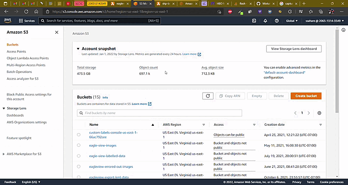
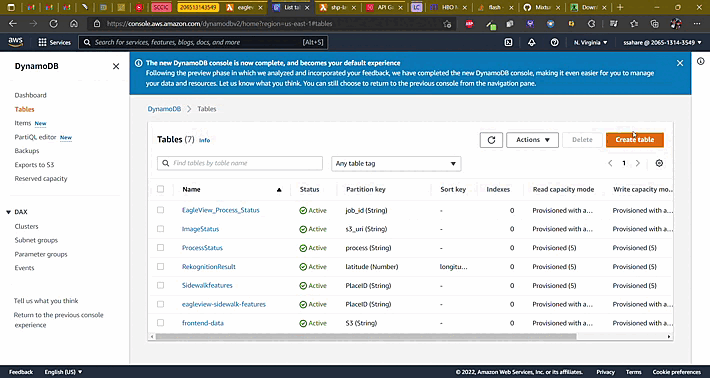
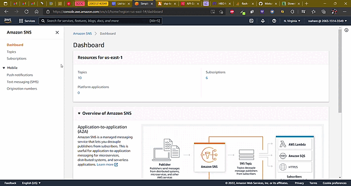
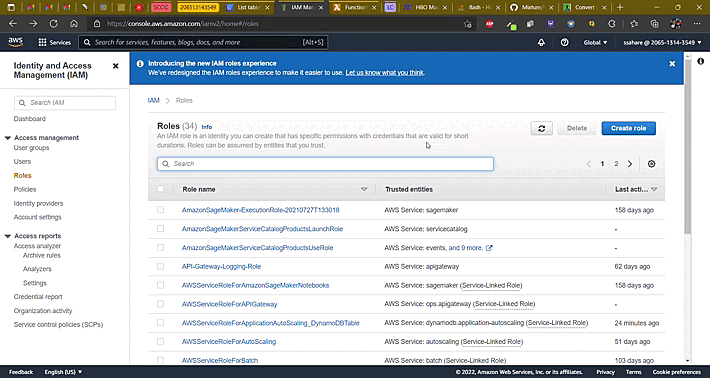
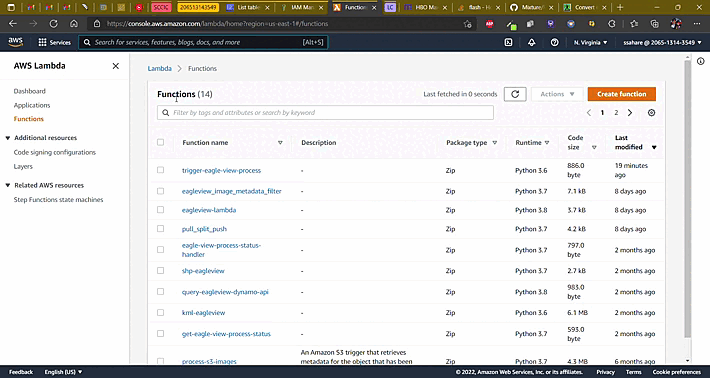
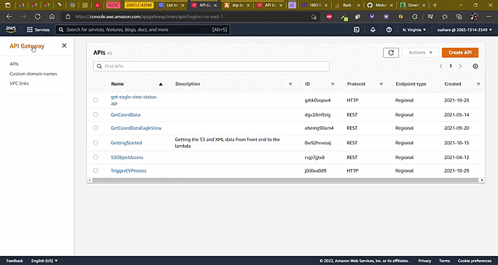

# CurbPHX Deployment Guide

## Prerequisites
- AWS Account

## Services
We will leverage the power of the following services:
  - [Lambda functions and layers](https://aws.amazon.com/lambda/)
  - [DynamoDB](https://aws.amazon.com/dynamodb/)
  - [Amazon Rekognition](https://aws.amazon.com/rekognition/)
  - [Simple Storage Service](https://aws.amazon.com/s3/)
  - [Simple Notification Service](https://aws.amazon.com/sns/?whats-new-cards.sort-by=item.additionalFields.postDateTime&whats-new-cards.sort-order=desc)
  - [Virtual Private Cloud](https://aws.amazon.com/vpc/)
  - [Elastic Compute Cloud](https://aws.amazon.com/ec2/)

## Instructions

All the files you need are available in this repository, so the first step would be to clone this repository locally. Next log in to your AWS account and follow the steps for each service listed below.

### S3
- Create buckets with the following names ->
  1. eagleview-unprocessed-images
  2. eagleview-processed-images
  3. export-data-phx-cic

**In case any of these names are not available, try a different region.**

#### NOTE: if you wish to change the names of the buckets, please make sure those names are reflected in the code-base as well. Do check individual Lambda readme files for **environment variables** which use these buckets.

[Tutorial](https://docs.aws.amazon.com/AmazonS3/latest/userguide/create-bucket-overview.html)

### DynamoDB
- Create tables with the following (Name - Partition ID - datatype) ->
  1. EagleView_Process_Status - job_id - string
  2. ImageStatus - s3_uri - string
  3. eagleview-sidewalk-features - PlaceID - string 

Go the AWS console and use default configurations to create each of these tables.

[Tutorial](https://docs.aws.amazon.com/amazondynamodb/latest/developerguide/getting-started-step-1.html)

### SNS
- create the following Standard Topics ->
  1. EV-Process-Notifier	
  2. image_metadata_filter	
  3. trigger-ev-process	
  4. trigger-shp	
  5. trigger_rekognition_eagleview

Use default configurations to create each of these topics.

[Tutorial](https://docs.aws.amazon.com/sns/latest/dg/sns-getting-started.html#step-create-queue)

#### Note: We will add subscriptions later after creating Lambda Functions

### Lambda Functions
#### Prerequisites:
**Lambda Layers**
Before deploying lambda functions, we need to set up custom lambda layers. Follow the tutorial linked below and create custom layers for [Lambda Functions/geopandas.zip](Lambda%20Functions/geopandas.zip) and [Lambda Functions/shp-layer.zip](Lambda%20Functions/shp-layer.zip)
[Tutorial-for-Lambda-Layers](https://docs.aws.amazon.com/lambda/latest/dg/configuration-layers.html#configuration-layers-create)

Instead of re-deploying lambda layers, you can also use the ones deployed by us.
The API ARNs are as follows ->
  1. GeoPandas -> 	arn:aws:lambda:us-east-1:206513143549:layer:geopandas:11
  2. Shapefile Layer -> 	arn:aws:lambda:us-east-1:206513143549:layer:shp-layer:2

**IAM Role**
You may create a role for each lambda function or one common role for all lambda functions.
Below is a tutorial on creating one for all lambdas, you may create multiple as needed.

Go to IAM -> Roles -> create role

Add full access permissions to ->
1. SNS
2. S3
3. DynamoDB
4. Rekognition
5. CloudwatchLogs

We need to deploy **one lambda function each** for corresponding directory inside the /'Lambda Functions'

General tutorial to deploy lambda functions -> [Tutorial](https://docs.aws.amazon.com/lambda/latest/dg/getting-started-create-function.html)

#### Note : Upload all files given in each directory and name the lambda functions the same as the folder name. Follow individual instructions in the respective folders in Lambda Functions directory.

### API Gateway 
Create the following API Gateway configurations ->
1. get-eagle-view-process-api -> HTTP API --> GET --> Integrate with **get-eagle-view-process-status** Lambda function
2. GetCoordDataEagleView -> HTTP API --> GET --> Integrate with **query-eagleview-dynamo-api** Lambda function
3. TriggerEVProcess -> HTTP API --> GET --> Integrate with **trigger-eagle-view-process** Lambda function

[Tutorial](https://docs.aws.amazon.com/apigateway/latest/developerguide/getting-started-with-lambda-integration.html)

#### Basic steps ->
1. Search 'API Gateway' and go to it's console.
2. Click on 'Create API'
3. Click on 'Build' under HTTP API
4. Click on 'Integration' -> Lambda and select the corresponding lambda function

### Rekognition
Follow the other [readme document](./rekognition.md) in this folder for Amazon Rekogntion.