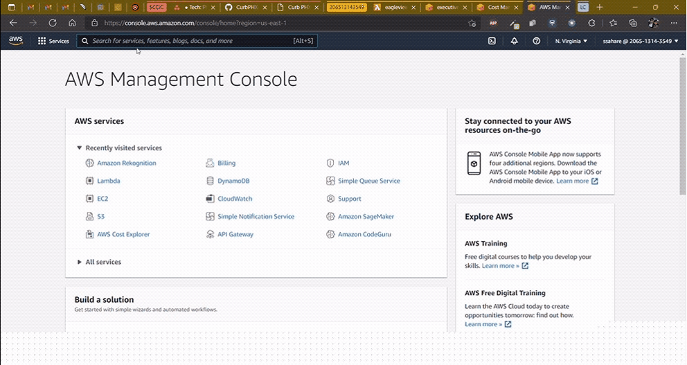
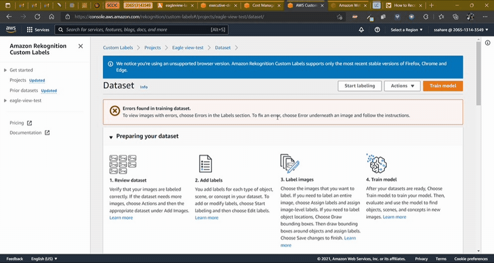
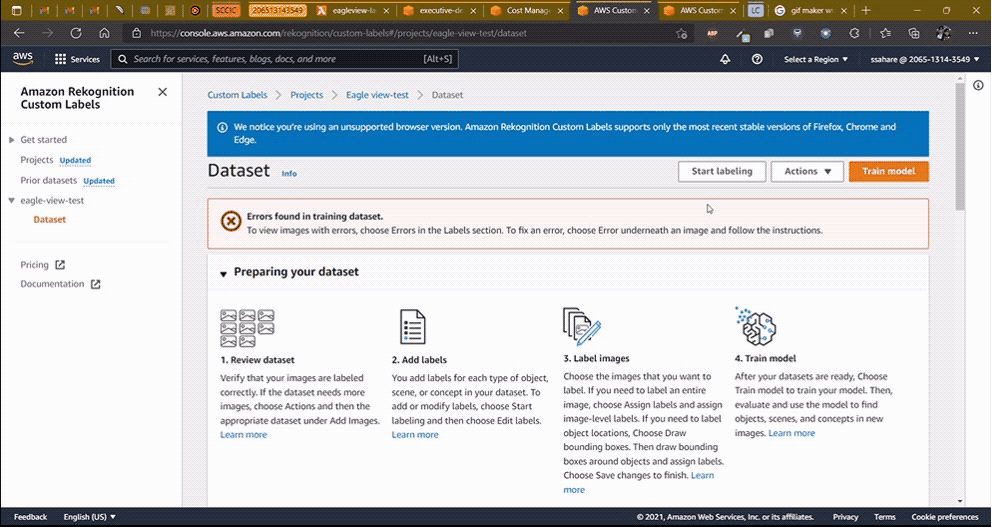
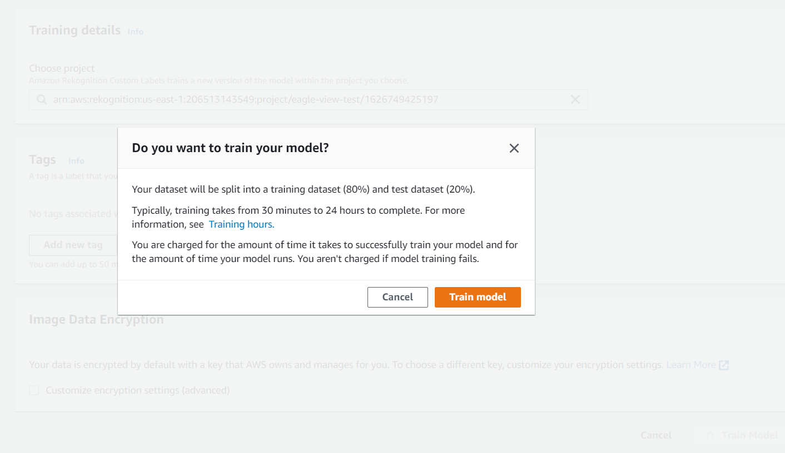
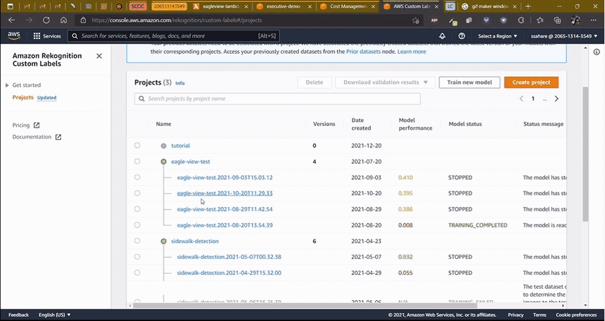
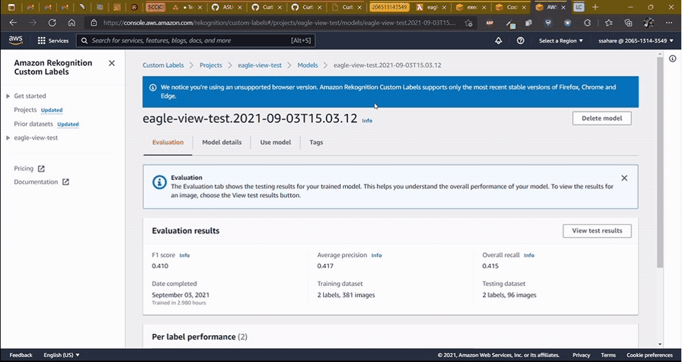

# Instructions to use AWS Rekognition

## Training the model

#### [All Rekognition Tutorials](https://console.aws.amazon.com/rekognition/custom-labels#/get-started/tutorials)

### Uploading the dataset

- Type **Rekognition** on the AWS console search bar and select the service. click on **Use Custom Labels** on the top left part of the window and then click on **Get Started** button (make sure to check the region on your top right, the service is not available in many regions. For now, we recommend **North Virgina (us-east-1)**)

- Create a new Project following this [tutorial](https://www.youtube.com/watch?v=Mse5Jgh9n3M&t=2s).  To summarize the video, do the following ->
    - Create a new **Dataset** and import images using S3 bucket. Alternatively, you can also upload them directly but it only allows 30 images at a time, so it can be a time consuming task.
    - **Turn off Automatic Labelling** as we will have to label the sidewalk data manually

### Labelling the dataset
- Next, we need to label the images. For every attached, detached or no sidewalk identified in the dataset, we need to draw bounding boxes around each instance with the appropriate labels as demonstrated below.
    - To Create labels, click on **Start Labelling** -> **Manage Labels** -> Add label names and click on **Add label** -> Click on **Save**
    - We create three labels
        1. Sidewalks
        2. Detached Sidewalks
        3. No Sidewalks 
    
    - Next, we assign labels to each image. We can select up to 9 images at once for labelling, once selected, click on **Draw bounding boxes** and follow the steps shown below.
    
    - Add atleast **250 images per label** for a decent model, but we recommend going for **500 images per label** for maximum precision in detection of labels.

### Training the model
- Once labels have been assigned to each image, we need to train the model. This will take anything from 30 minutes to 24 hours. Do keep in mind that the time it takes to train will be chargeable. [Rekognition Pricing](https://aws.amazon.com/rekognition/pricing/)
    - Go to your project and click on **Train Model**. Verify the configuration, nothing needs to be changed here, you may add tags to track your pricing/cost model. Click on **Train Model** again and you will be greeted by yet another dialog prompt which reminds you that the training is chargeable. Click **Train Model** once again to start training.
    
    

### Evaluating the model
- Once training is completed, click on the newly trained model and it navigates you to the evaluation section. It shows you the precision, recall and F1 score of your model. Keep in mind that these **metrics are under-reported** and misleading due to the **concept of IoU (Intersection of Union) which is not taken into account**. So values **between 30 - 50 are considered decent**. A model with more images will have a higher F1 score.

### Using the model
- Prior to running the application process, you will need to start the model, this is required manually so as to have complete control on the number of inference instances, saving the cost of running the model, and avoiding programmatic access to something which costs quite the bulk of the expense.
- To start the model, click on the project that we created before, click on the model which you wish to start (in-case you have multiple trained) then click on the **Use Model** tab which will show you a dropdown to select number of inference instances. Then click on **Start**. It will take up to 30 minutes for the model to start

- Once the application is no longer in use, **stop the model to avoid incurring any unnecessary charges**. Check the pricing linked above for inference pricing, but in general it is **approximately $4 per hour**, which is A LOT!

# TURN OFF THE MODEL WHEN NOT IN USE!